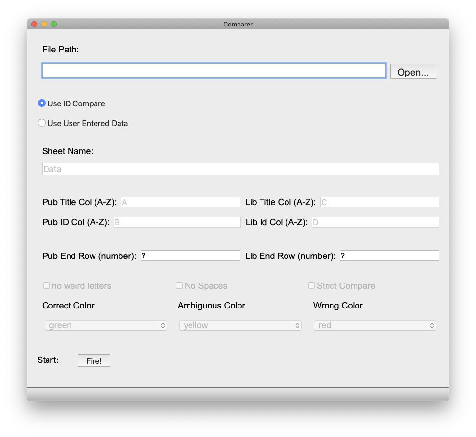

# LibCompare

## Introduction

This is a app that compares the titles (with ISBN/ISSN) between those from publishers and my school library. 

## Usage

Open main.app. This action takes a few seconds. 

Then you will see following window:

Use the template file in the Repo/Release to fill in contents. The column title will guild you filling in the content.

Save the template with the data into another file, since you may need to use the template again. 

Click `Open...` button and choose the file you just selected. And then enter where the column ends, ie the numer of the last filled row. 

Most of the time, clicking on `Fire` with do the trick.

Or you can click on the `Use User Entered Data` to cusomize what you want the program to read and output. 

After clicking on `Fire`, you will need to choose where the result file you want to save and name. 

Wait a few seconds, multiple notification popup will show during this time. Read Carefully (Maybe). 

If you have any problems or bugs, please report an issue. 

Thanks. 

